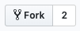

# Uber Eats clone com React!
> Estilos já prontos, foco no aprendizado com React.js

* [Demonstração do produto final](https://mighty-journey-53060.herokuapp.com/)
* [English Version](README_EN.md)

## Configuração
1. Instale o [git](https://git-scm.com/downloads)
2. Instale o [node.js](https://nodejs.org/en/)
3. Instale o [yarn](https://yarnpkg.com/lang/en/docs/install/)
4. Instale o [vscode](https://code.visualstudio.com/)
* Baixe a extensão para [snippets de React](https://marketplace.visualstudio.com/items?itemName=dsznajder.es7-react-js-snippets)
* Caso precise de ajude com acesso remoto, instale o [live share](https://marketplace.visualstudio.com/items?itemName=MS-vsliveshare.vsliveshare)
5. Crie uma conta no [Github](https://github.com/)
6. Crie uma conta no [Heroku](http://heroku.com)
7. Clique no botão de "Fork" no canto superior direito dessa página
* 
8. Clone *o repositório que você acabou de 'forkar'* na sua máquina
* `git clone https://github.com/your_username/clone-eats-react`
9. Inscreva-se no meu canal do [twitch](https://www.twitch.tv/patrickcoding), vamos desenvolver a UI juntos dia 27 das 14h as 18h (GMT-3)

## O que vamos desenvolver?
* [ ] Rota para página inicial
* [ ] Rota para produtos de cada restaurante
* [ ] Rota para carrinho
* [ ] Transição entre rotas (com [react-pose](https://www.npmjs.com/package/react-pose))
* [ ] Adicionar [Context API](https://reactjs.org/docs/context.html) para controlar estados da aplicação

## Para que serve esse repositório?
Esse repositório já tem os estilos e imagens que vamos usar no projeto! Além disso, temos uma configuração de boas práticas de código a partir do ESLint!

## Muito obrigado!
* [Flaticon](https://www.flaticon.com/)
* [Dropbox](https://dropbox.com)
* [Unsplash](http://unsplash.com)
* [Popmotion](https://popmotion.io)